# Day - 14 - AM - Pandas Fundamentals

## Part A - Query Analysis

In this section, we will explore how to use Pandas to demonstrate querying a database using SQL and compare it with SQL results

## Key Learnings

-  Using .read_sql_query() to query a database and load data into a DataFrame
-  Using .to_sql() to export data from a DataFrame to a SQL database
-  Using .query() to filter data using conditional statements
-  Using .groupby() to group data by one or more columns
-  Using .agg() to apply aggregation functions to grouped data

## File Link :- 

- [`query_analysis.ipynb`](./sql_pandas_analysis/query_analysis.ipynb) - This file contains the code for demonstrating querying featuresusing Pandas to compare it with SQL results.

## SQL Script Link :- 

- [`script.sql`](./sql_pandas_analysis/script.sql) - This file contains the SQL script for querying a database. It consists of 20 examples.

## Data Files :-

- [`customers.csv`](./sql_pandas_analysis/data/customers.csv) - Customer data with columns such as customerName, contactName, address, city, postalCode, country and phone.

- [`employees.csv`](./sql_pandas_analysis/data/employees.csv) - Employee data with columns such as employeeNumber, lastName, firstName, email, jobTitle, birthDate, hireDate, reportsTo and officeCode.

- [`monthly_salaries.csv`](./sql_pandas_analysis/data/monthly_salaries.csv) - Monthly salary data with columns such as employeeNumber, month, salary.

- [`offices.csv`](./sql_pandas_analysis/data/offices.csv) - Office data with columns such as officeCode, city, phone, addressLine1, addressLine2, state, country, postalCode and territory.

## Output:- 

### SQL Script :- 

#### 1. Get all employees working in USA
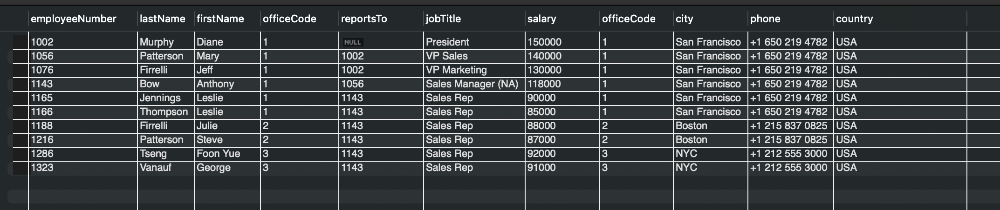

#### 2. Get all employees with salary greater than 100000

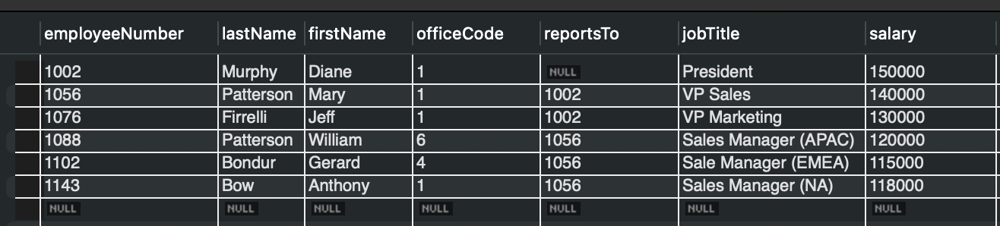

#### 3. Get all employees who have sales rep rule

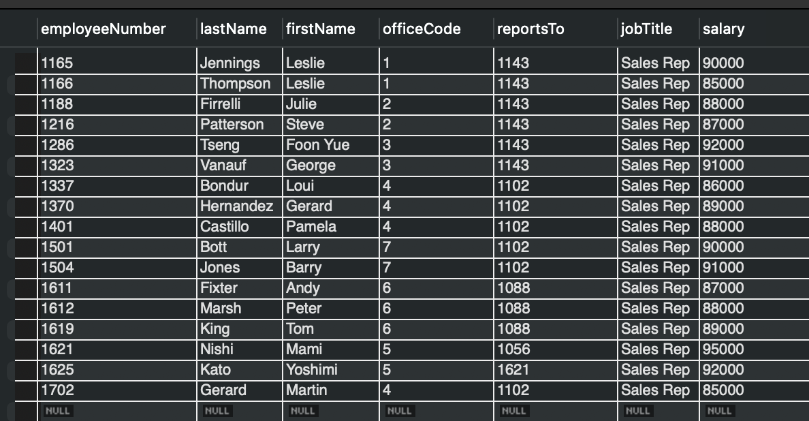

#### 4. Get all employees who reports to employee with employee number 1056

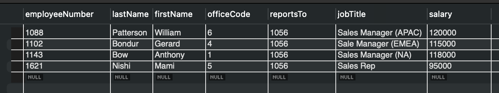

#### 5. Get all employee records who live in city Paris 

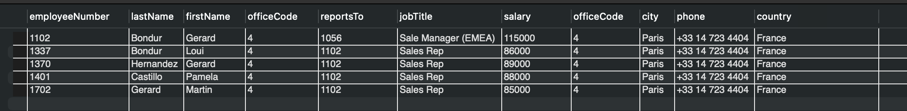

#### 6. Get all employee records with office details (city and country)

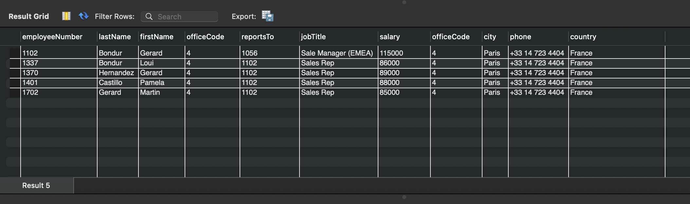

#### 7. Get all sales reps with their customer count (including those with zero customers)

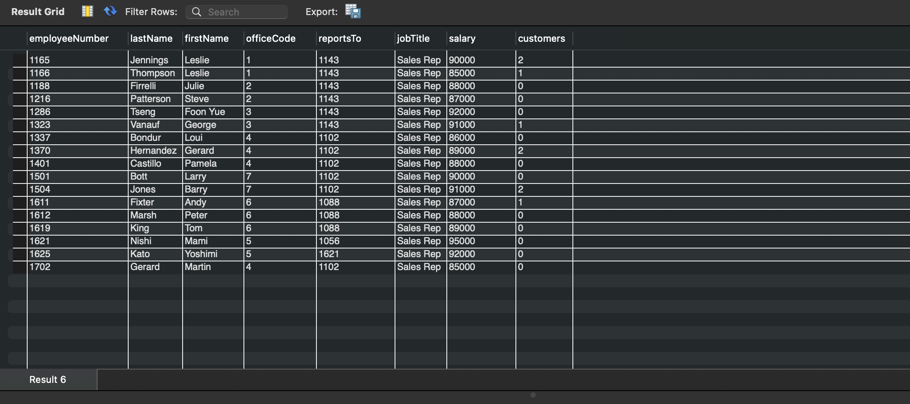

#### 8. Get all managers with their direct reports count

#### 9. Get all sales reps who do not have any customers assigned

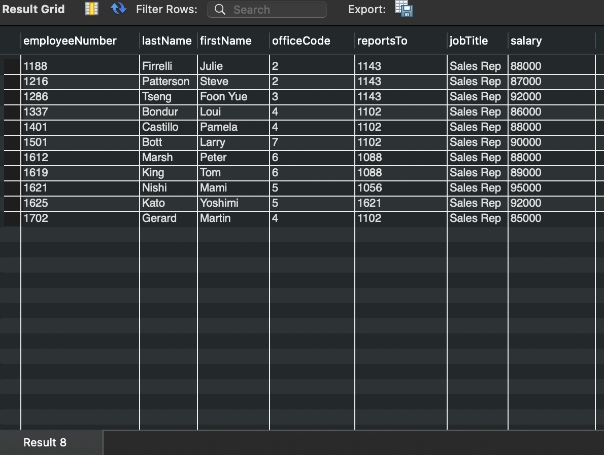

#### 10. Get the number of sales reps per country

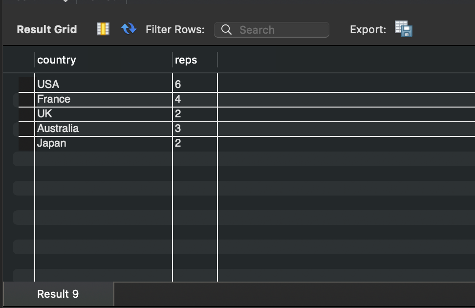

#### 11. Get the average salary per office

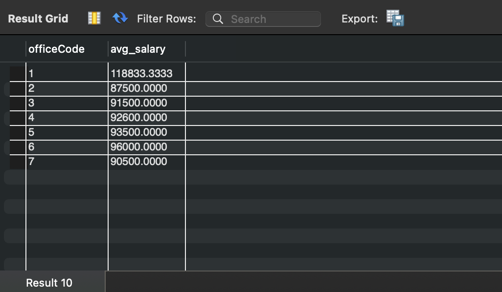

#### 12. Get the number of employees per country
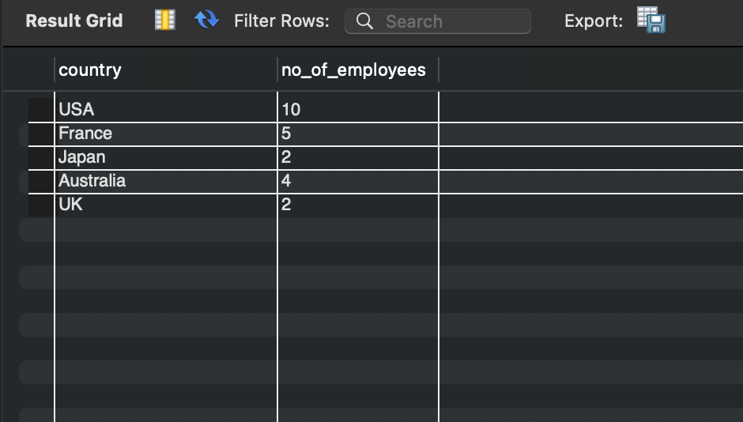

#### 13. Get the job title with the highest number of employees
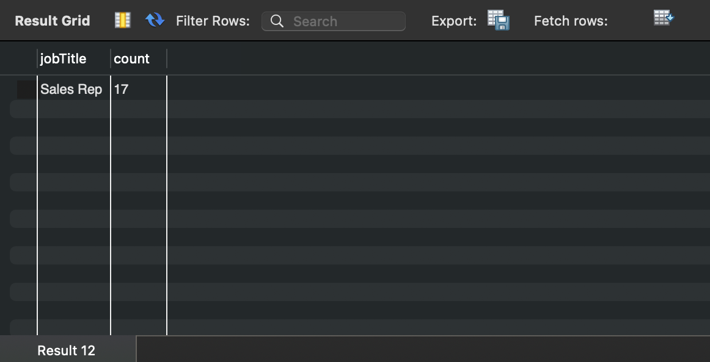

#### 14. Get the maximum salary for each manager (reportsTo)

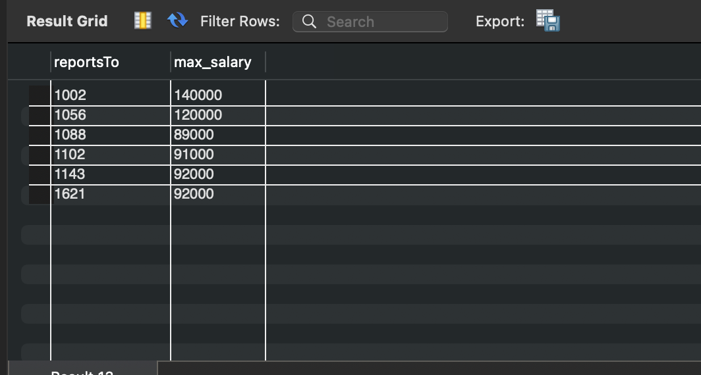

#### 15. Get the number of employees reporting to VPs
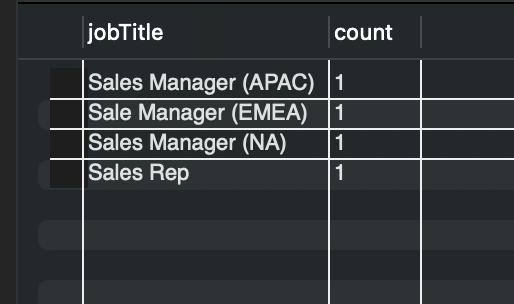

#### 16. Get the ranking of sales reps based on their customer count, partitioned by country and globally
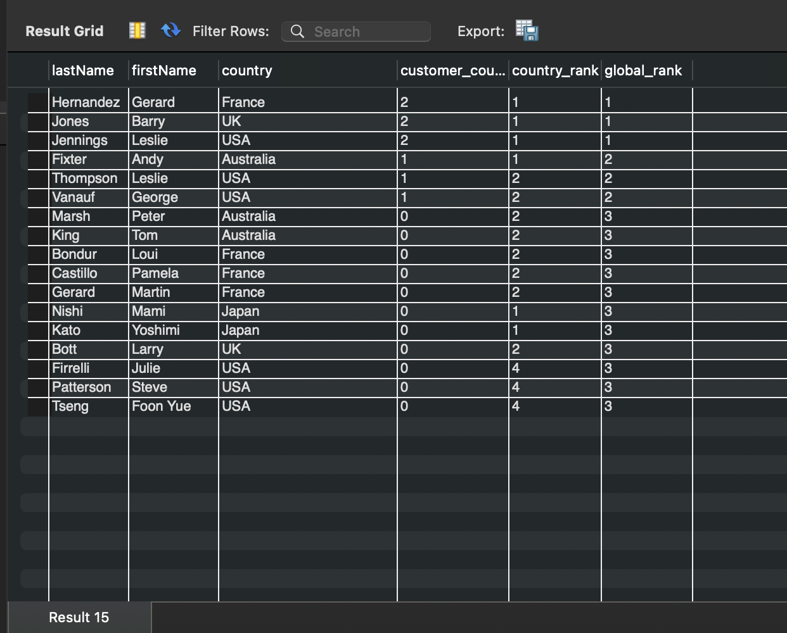

#### 17. Get the top 3 highest paid employees in each office
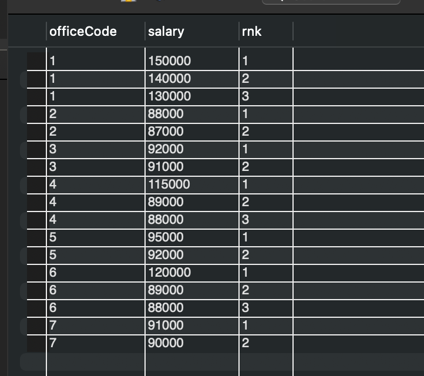

#### 18. Get the month-over-month salary growth percentage for each employee
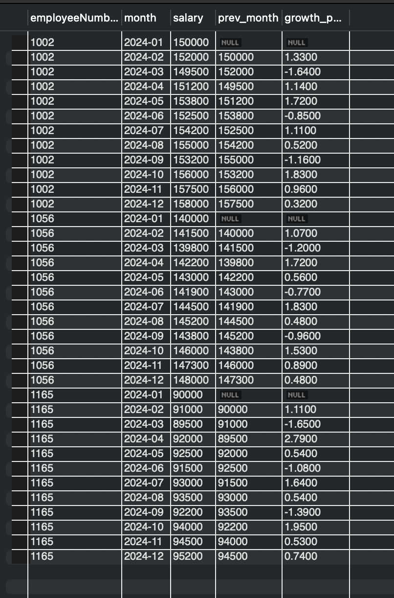

#### 19. Get all employees whose salary is above the average salary of their office

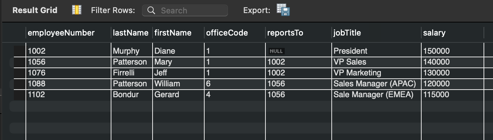

#### 20. Get all employees whose salary is above the average salary of their office (without using CTEs)

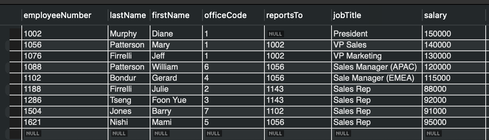

### Using explain to understand the query

#### 2. Get all employees with salary greater than 100000
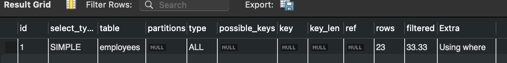

#### 3. Get all employees who have sales rep rule

#### 4. Get all employees who reports to employee with employee number 1056
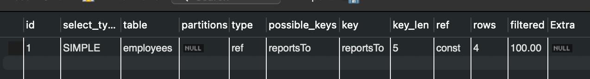

## Part B - Stretch Problem
 
 In this section, we will create a 'projects' table (project_id, project_name, lead_emp_id, budget, start_date, end_date). Insert 5 rows. Write:
 -  (1) a 3-table JOIN showing employee name, department budget, and project budget; 
 - (2) a query showing departments where total project budget exceeds department budget.

## SQL Script Link :- 

- [`script.sql`](./sql_pandas_analysis/script.sql) - This file contains the SQL script for querying a database. It consists of 20 examples.

## Output:- 

### 1. 3-table JOIN: employee name, department budget, project budget
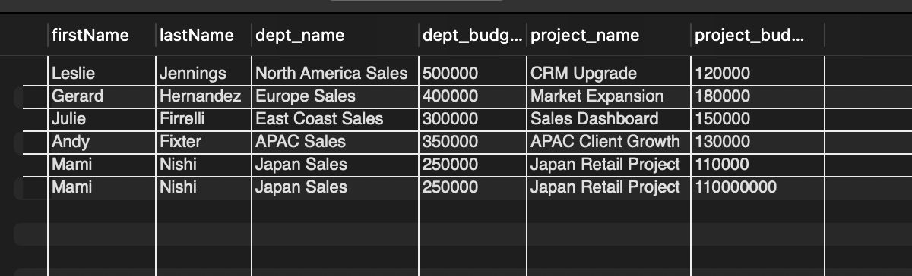

### 2. Departments where total project budget exceeds department budget

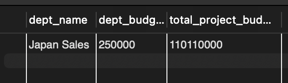

