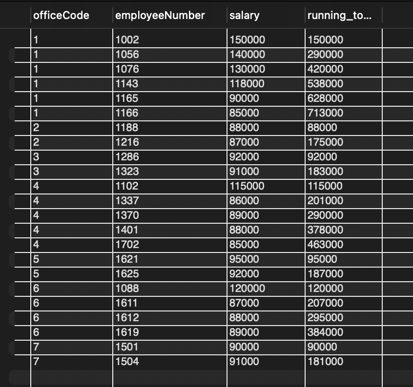
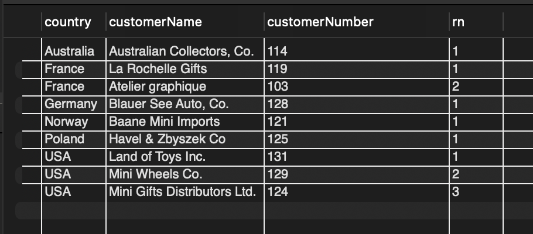
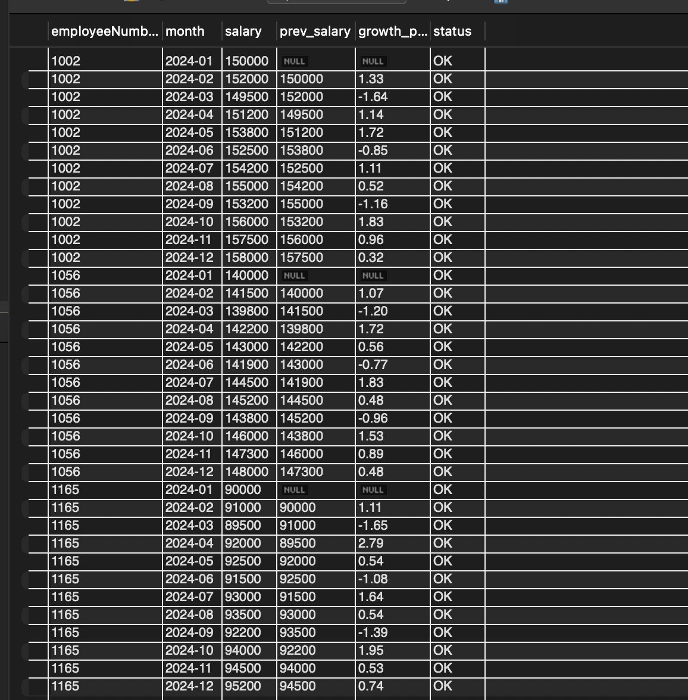
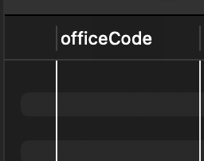
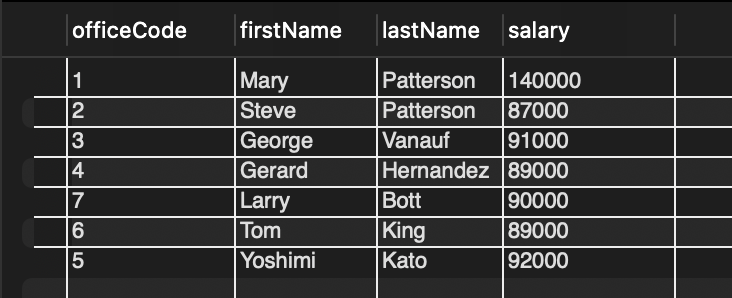
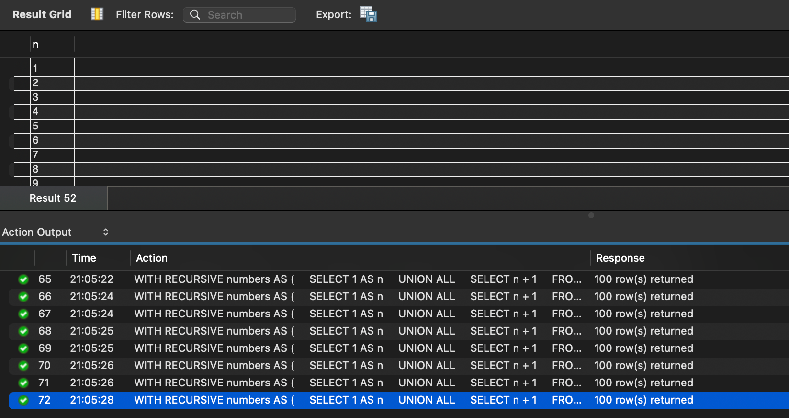
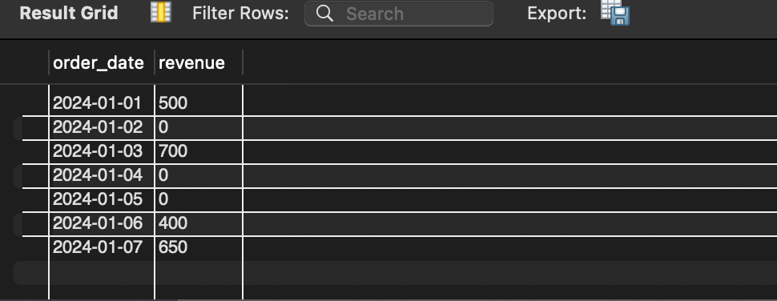

# Day - 14 - PM - SQL Advanced

## Part A - Concept Application

To solve SQL queries using advanced analytical techniques such as window functions, CTEs, and correlated subqueries to solve business-style problems including cumulative totals, ranking, growth analysis, and salary comparisons.

## Key learnings:

- Learned how window functions calculate row-wise analytical results without collapsing data.

- Used SUM() OVER() for running totals across ordered records.

- Applied ROW_NUMBER() to solve Top-N ranking problems within groups.

- Used LAG() to compare current and previous rows for month-over-month growth analysis.

- Understood how CTEs break complex queries into readable logical steps.

- Learned how correlated subqueries solve ranking problems without window functions.

- Practiced partitioning data using PARTITION BY for group-based analysis.

## SQL Script Link :- 

- [`script.sql`](./script.sql)

`NOTE:` Used same database created in [Day-14-AM-Assignment](../query_analysis/README.md)
## Output:- 

### 1. Running total: cumulative salary per office ordered by employee number

### 2. Top-3 customers by revenue per country using ROW_NUMBER()

### 3. MoM salary growth using LAG and flag below -5%

### 4. Multi-CTE: offices where all employees earn above company average

 

### 5. Correlated subquery: 2nd highest salary per office without window functions

## Part B - Stretcb Problem

This task uses recursive CTEs to generate sequential data such as number series and continuous dates, then applies that generated sequence to solve missing-value problems in time-series data such as absent order dates.

### Key learnings:

- Understood how to generate a number series without hard-coded tables.

- Used recursion to create a continuous date range from sparse transactional data.

- Used COALESCE() to replace missing revenue values with zero.

- Practiced solving a common data engineering interview problem involving sparse time series.

## Output:- 

### 1. Generate numbers 1 to 100 using recursive CTE

### 2.  Fill missing dates using recursive CTE

## Part C - Interview Answers

Solutions in File:- [interview_answers.md](./interview_answers.md)

## Part D - AI - Augmented

Solutions in File:- [ai_augmented.md](./ai_augmened.md)