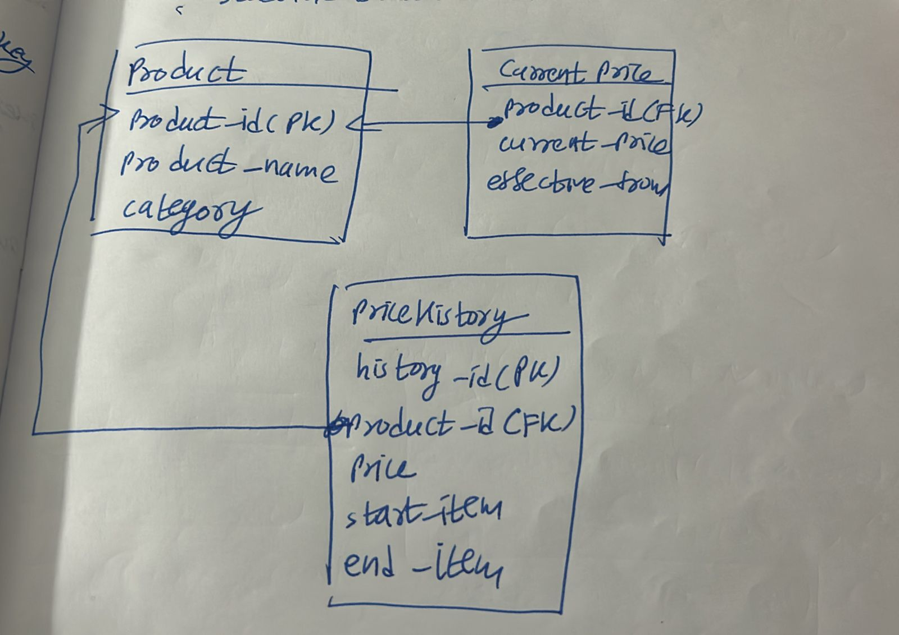

# Q1. Conceptual

In a denormalised database, update anomalies happen because the same information is repeated in multiple records. When one copy is changed but others are not, inconsistent data appears.

## 1. Update Anomaly

Suppose an e-commerce system stores customer name, address, and every order in one single table. If a customer named Ravi has placed multiple orders, his address is repeated for every order. When Ravi changes his address from Ahmedabad to Surat, every order record must be updated. If one record is missed, the database will contain two different addresses for the same customer.

## 2. Insertion Anomaly

If a new customer registers but has not placed an order yet, the system may not allow storing customer details because order-related fields are also required.

## 3. Deletion Anomaly

If Ravi has only one order and that order is deleted, the customer’s details may also be lost because they were stored only inside the order record.

# Q2. Design

# Q3 Conceptual

The ACID property at risk is Isolation.

## Why Isolation is at Risk

When two users try to book the last hotel room at the same time, both transactions may read that the room is available before either transaction finishes. Without isolation, both could confirm booking, causing double-booking.

## How the Database Prevents Double-Booking

The database uses locking or transaction isolation control:

- When the first transaction starts booking, the room record is locked.
- The second transaction must wait until the first transaction finishes.
- If the first booking commits, the second transaction reads updated data and sees no room available.

