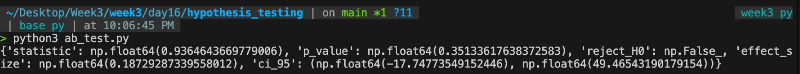

# Q1. Conceptual

## Difference Between p-value and Confidence Interval

A p-value tells you whether the observed result is likely to have happened by chance if there were actually no real effect. For example, in an A/B test, a p-value below 0.05 suggests the difference between two versions is unlikely to be random and is statistically significant.

A confidence interval gives a range of plausible values for the true effect size. Instead of only saying whether an effect exists, it tells you how big the effect might realistically be.

## Example for a Product Manager

Suppose a new checkout design increases average order value by ₹40:

- p-value = 0.01
  - Strong evidence that the increase is real, not random.

- 95% confidence interval = ₹10 to ₹70
  - The actual improvement is likely somewhere between ₹10 and ₹70.

## Main Difference

 - p-value answers: "Is this effect statistically real?"
 - Confidence interval answers: "How large is the effect likely to be?"

## When Each Is More Useful

### Use p-value when:

- Making a yes/no decision
- Deciding whether to launch an experiment result
- Testing if an observed difference is statistically significant

### Use confidence interval when:

- Estimating business impact
- Comparing whether improvement is practically meaningful
- Understanding uncertainty around the estimate

## Product Decision Perspective

A small p-value alone is not enough. A feature may be statistically significant but produce only a tiny business gain. Confidence intervals help decide whether the gain is large enough to matter commercially.

# Q2. Coding 

- ### [AB Testing Code File](./ab_test.py)

### Output:-

# Q3. Conceptual

## Three Questions to Ask Before Agreeing:-

### 1. Is the effect practically meaningful for the business?
   A p-value of 0.04 only says the result is statistically significant, but an effect size of 0.02 is extremely small. I would ask whether that improvement creates enough revenue, retention, or conversion impact to justify engineering effort.

### 2. How large was the sample size?
   Very large samples can make tiny effects look statistically significant. I would check whether significance is driven mainly by huge traffic rather than meaningful customer impact.

### 3. What are the rollout costs and risks?
   Even a statistically positive change may not be worth shipping if implementation adds complexity, harms other metrics, or creates long-term maintenance cost.
