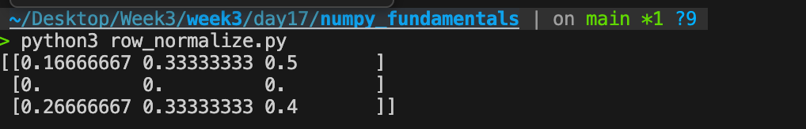

# Q1 Conceptual 

## Broadcasting explained with a real-world analogy

Imagine a classroom with 200 students and 8 subjects written as a table. If you want to add 5 bonus marks to every subject for every student, you can use one small list of 8 bonus values instead of rewriting 200 rows manually. NumPy automatically stretches that small list across all rows so the shapes match — this automatic stretching is called broadcasting.

## The 3 formal broadcasting rules

1. NumPy compares array shapes starting from the rightmost dimension.
2. Two dimensions are compatible if they are equal or one of them is 1.
3. If one array has fewer dimensions, NumPy treats missing dimensions as 1 on the left.

## Example where broadcasting works

A (3, 4) matrix plus a (4,) vector works because the vector is stretched across rows.

```python 
import numpy as np

A = np.array([[1, 2, 3, 4],
              [5, 6, 7, 8],
              [9, 10, 11, 12]])

B = np.array([10, 20, 30, 40])

result = A + B
print(result)
```

Here shape (3,4) + (4,) becomes valid because (4,) acts like (1,4).

## Example where broadcasting fails

A (3,4) matrix plus a (3,) vector fails.

```python
A = np.array([[1, 2, 3, 4],
              [5, 6, 7, 8],
              [9, 10, 11, 12]])

B = np.array([10, 20, 30])

# This gives an error
A + B
```

This fails because shapes (3,4) and (3,) do not match from the right: 4 != 3.


# Q2 Coding 

```python
import numpy as np

def row_normalize(arr: np.ndarray) -> np.ndarray:
    """Normalize each row to sum to 1. Zero-sum rows stay as zeros."""
    row_sums = arr.sum(axis=1, keepdims=True)
    return np.divide(arr, row_sums, out=np.zeros_like(arr, dtype=float), where=row_sums != 0)

```

## File:-

[row_normalize.py](./row_normalize.py)
## Output:-




# Q3 Debug 

## Issues in the code

### 1. Boolean condition uses and instead of element-wise operator

and works only for single True/False values, not NumPy arrays. With arrays, NumPy needs element-wise logical comparison, so & must be used.

### 2. Missing parentheses around comparisons

When using &, each condition must be wrapped in parentheses because comparison operators have higher precedence.

### 3. Reshape size mismatch

After filtering, values are [3, 4], which gives 2 elements. Reshaping into (2,1) works only because total size remains 2 — but this depends on filtered output size, so shape assumptions should be checked.

## Corrected version

```python
import numpy as np

data = np.array([1, 2, 3, 4, 5])

mask = (data > 2) & (data < 5)
filtered = data[mask]

result = filtered.reshape(-1, 1)

print(filtered)   # [3 4]
print(result)
```

## Why reshape(-1,1) is safer

-1 lets NumPy automatically determine row count, so it avoids hardcoding dimensions if filtered size changes later.
